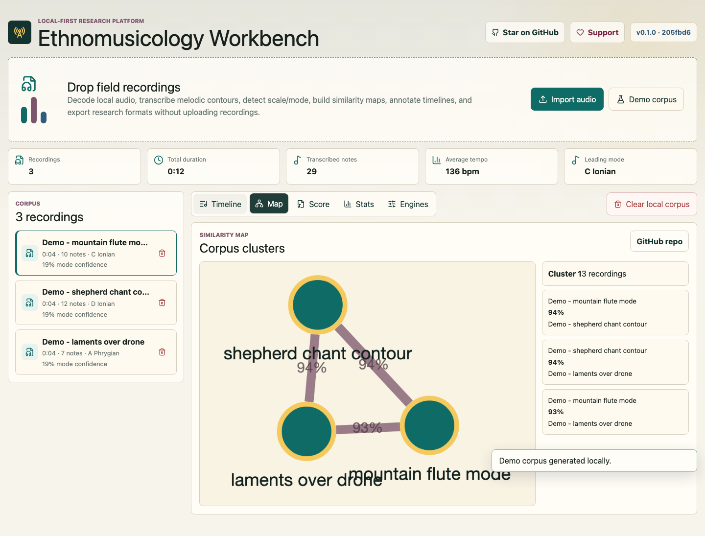
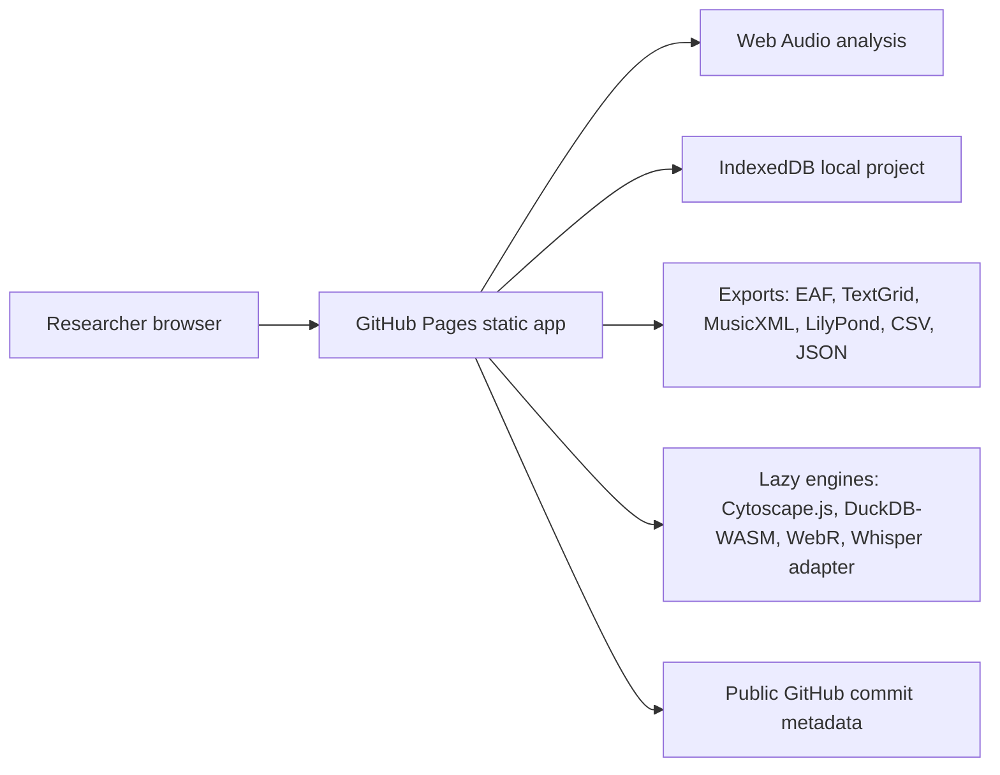

# Ethnomusicology Workbench

Browser-based ethnomusicology lab for local audio transcription, analysis, annotation, statistics, and score export.

Live site: https://baditaflorin.github.io/ethnomusicology-workbench/

Repository: https://github.com/baditaflorin/ethnomusicology-workbench

GitHub repository: https://github.com/baditaflorin/ethnomusicology-workbench

Support the project: https://www.paypal.com/paypalme/florinbadita

## What it does

Ethnomusicology Workbench is a local-first research platform for field recordings. It imports local audio, extracts pitch and acoustic features in the browser, clusters a corpus by similarity, supports timeline annotations, runs reproducible statistical summaries, and exports ELAN, Praat TextGrid, CSV/JSON, MusicXML, and LilyPond-compatible score files.



## Quickstart

```bash
npm install
make install-hooks
make dev
make test
make build
```

## Architecture

The app is Mode A: Pure GitHub Pages. There is no runtime backend, no server database, and no frontend secret. User recordings and analysis state stay in browser storage. Heavy computation is lazy-loaded behind user action through browser-native APIs, Web Workers, and WASM-capable libraries.

Architecture notes: docs/architecture.md

ADRs: docs/adr/

Deployment guide: docs/deploy.md

Privacy notes: docs/privacy.md



## Local checks

```bash
make fmt
make lint
make test
make build
make smoke
```

## Versioning

The live app shows the package version, build commit, and the latest public `main` commit fetched from the GitHub API.
