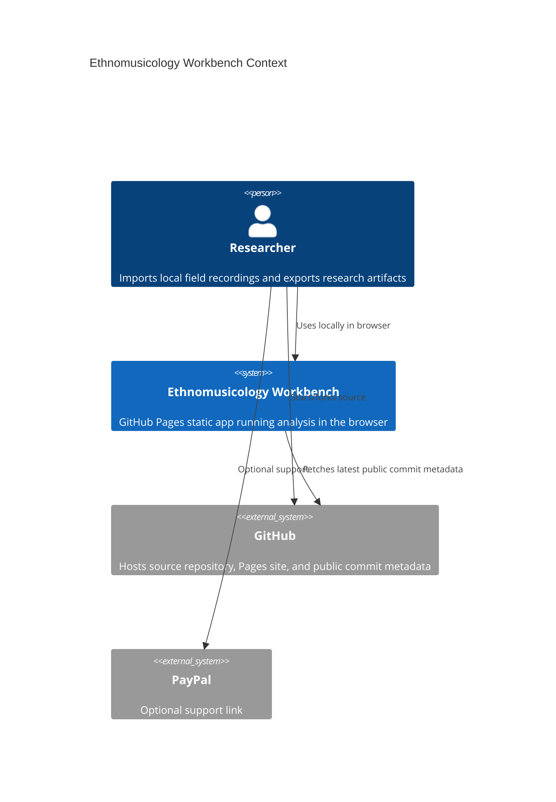
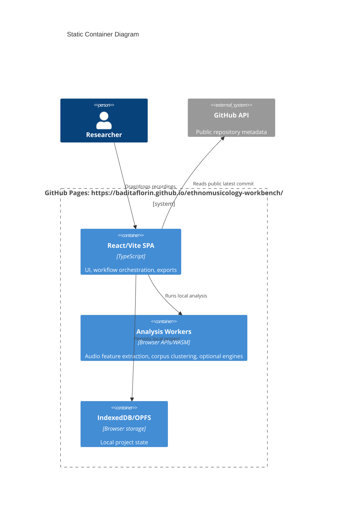

# Architecture

Ethnomusicology Workbench is a static, browser-only research platform served by GitHub Pages.

```mermaid
C4Context
  title Ethnomusicology Workbench Context
  Person(researcher, "Researcher", "Imports local field recordings and exports research artifacts")
  System(workbench, "Ethnomusicology Workbench", "GitHub Pages static app running analysis in the browser")
  System_Ext(github, "GitHub", "Hosts source repository, Pages site, and public commit metadata")
  System_Ext(paypal, "PayPal", "Optional support link")
  Rel(researcher, workbench, "Uses locally in browser")
  Rel(workbench, github, "Fetches latest public commit metadata")
  Rel(researcher, github, "Stars/forks source")
  Rel(researcher, paypal, "Optional support")
```

```mermaid
C4Container
  title Static Container Diagram
  Person(researcher, "Researcher")
  Boundary(pages, "GitHub Pages: https://baditaflorin.github.io/ethnomusicology-workbench/") {
    Container(spa, "React/Vite SPA", "TypeScript", "UI, workflow orchestration, exports")
    Container(workers, "Analysis Workers", "Browser APIs/WASM", "Audio feature extraction, corpus clustering, optional engines")
    Container(storage, "IndexedDB/OPFS", "Browser storage", "Local project state")
  }
  System_Ext(github, "GitHub API", "Public repository metadata")
  Rel(researcher, spa, "Drag/drops recordings")
  Rel(spa, workers, "Runs local analysis")
  Rel(spa, storage, "Persists local project")
  Rel(spa, github, "Reads public latest commit")
```

No runtime server, server database, or managed queue exists in v1.
